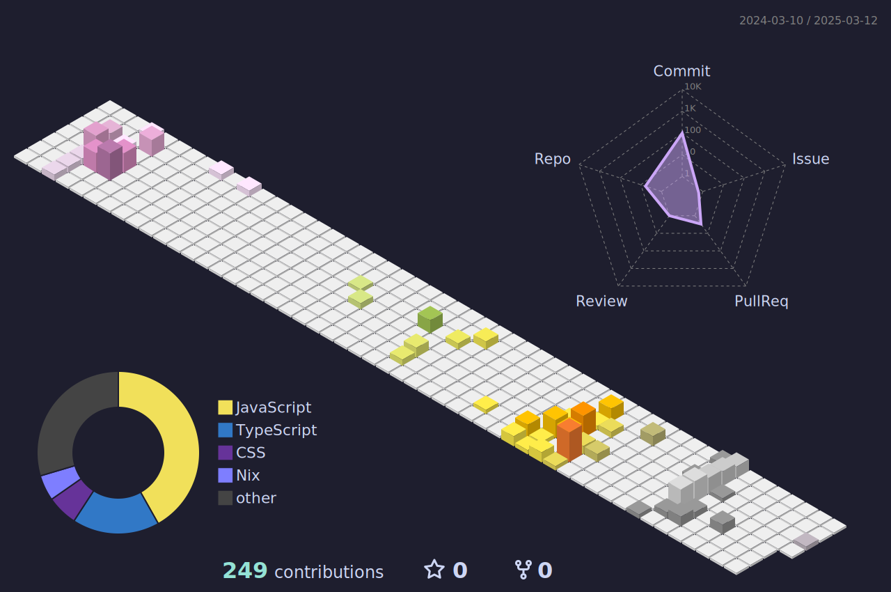

# Howdy <picture> <source src="https://fonts.gstatic.com/s/e/notoemoji/latest/1fae1/512.webp" type="image/webp"> </picture>  I'm Tinsuki nice to meet you <picture> <source src="https://fonts.gstatic.com/s/e/notoemoji/latest/1f44b/512.webp" type="image/webp"> </picture>

## About me <picture> <source srcset="https://fonts.gstatic.com/s/e/notoemoji/latest/2753/512.webp" type="image/webp"> </picture>
#### Hi ! I'm **Tinsuki** a 20 years old French student learning development. I'm passionate about programming, and I'm always looking for new things to learn.  I'm currently learning game design, and I'm also interested in game development.
### <a style="text-decoration: none; color: #cdd6f4;" href="https://www.tinsuki.dev" target="_blank" >Link to my website: <em>www.tinsuki.dev</em></a>

## 🚀 Tech Stack & Tools

### 💻 Programming Languages

  
  
  
  
  
  
  
  
  
  
  

### 🌐 Web Development

  
  
  
  
  
  
  

### 🗄️ Databases

  
  
  

### ⚙️ Tools & Development

  
  
  
  
  
  

### 🎨 UI/UX & Mobile

  
  

### 🔧 IoT & Hardware

  
  

## 📚 My projects 
___

### Smart Campus desktop web application ( ended ):

This project is part of my studies, it's a web application to get the quality of life data in the campus.  
The project is made with PHP, HTML, CSS, and JavaScript and using the framework symfony.  
The project is not available online, but you can find the code on github.  

___

### Smart Campus mobile web application ( ended ):

This project is part of my studies, it's a mobile application to get the quality of life data in the campus.   
The project is made with PHP, HTML, CSS, and JavaScript and using the framework symfony with APIPlatform for the api and React for the frontend.  
The project is not available online, but you can find the code on github.  

___

### Nuit de l'info 2023 ( ended ):

This project is part of the Nuit de l'info 2023, it's a web application about the climat change, the aim of the project is to raise awareness about the climat change without being too severe.  
The project is made with Php, HTML, CSS, and JavaScript.  
The project is not available online, but you can find the code on github.

___

### Nuit de l'info 2024 ( ended ):

This project is part of the Nuit de l'info 20234, it's a web application about the oceans, the aim of the project is to compare oceans and human bodies to help people understand why oceans are importants to Earth.  
The project is made with *NodeJS*, using *Vite*, *React*, and *TailwindCSS* in *Typescript*.  
The project is available at [playground.tinsuki.dev](https://playground.tinsuki.dev) and you can find the code on github.

___

### Battleship ( ended ):

This project is a battleship game made with C++ in terminal.  
The project is not available online, but you can find the code on github.

___

## My stats 

#### My GitHub stats

#### My most used languages

#### My contributions

